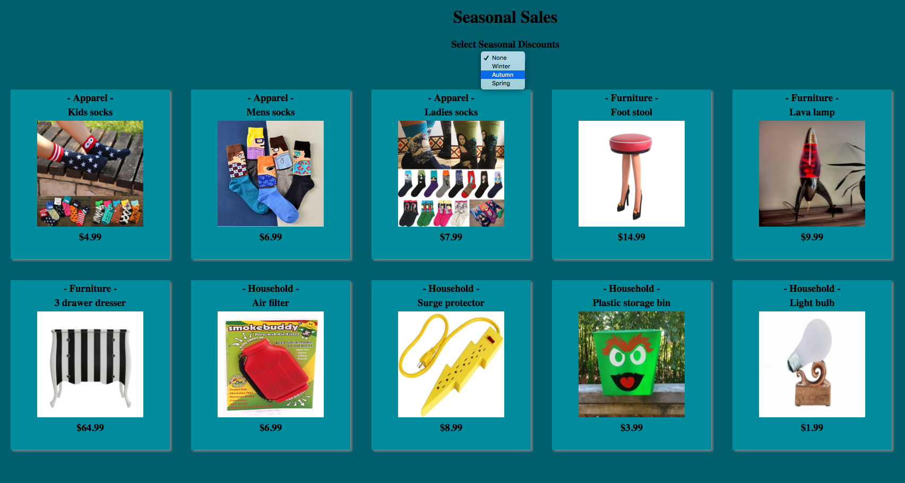
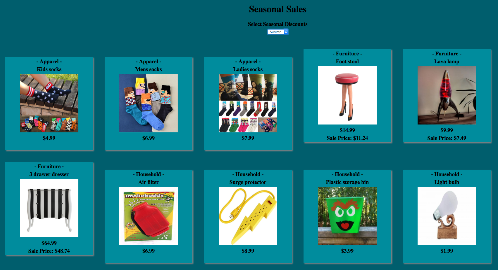

# Seasonal Sales

> Nashville Software School, Full-Stack Dev Bootcamp, Front-End Independant Exercise
> 

## Requirements

You work as a developer for a big box store. Here is a JSON representation of a small sample of the products you sell.

Your job is to build a web page that lists all of the products, the name of the department it's in, and the price. Additionally, put a `<select>` element at the top of the page that contains all possible values of the `season_discount` key in the categories file. 



As soon as you select one of the seasons, all prices on the page should immediately be discounted by the corresponding percentage.

For example, when _Spring_ is chosen, all products in the corresponding Household category should have their prices updated with a 15% discount off the base price.



Use two JSON files: `products.json`, and `categories.json`. You should load both files via XHRs and store the contents in two different JavaScript variables in your code.

	


### How to run (Node must be installed on your machine):
```
git clone https://github.com/lady-ace/Seasonal-Sales
cd Seasonal-Sales
npm install http-server -g
http-server -p 8080
```

This will show in your browser at:
`http://localhost:8080`

### Contributors:
[Jessica Brawner](https://github.com/lady-ace)